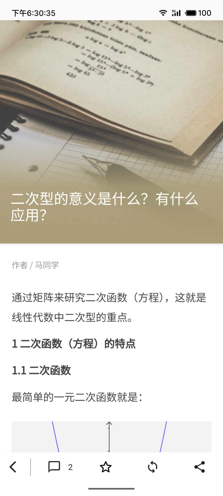
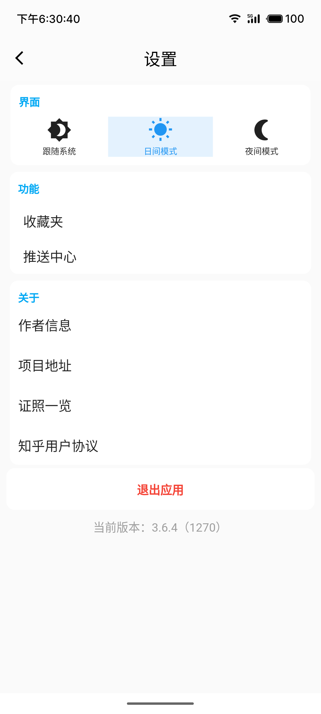
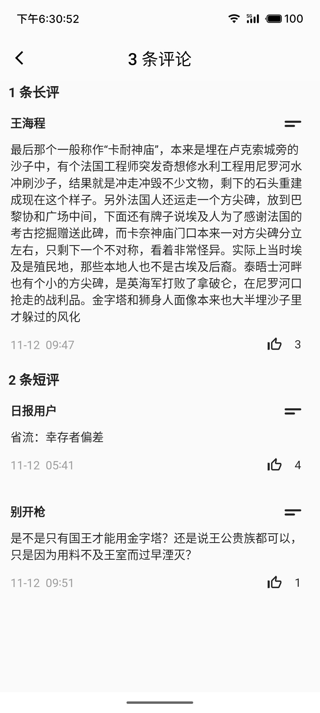

# 仿照知乎日报的flutter 应用

A new Flutter project.

## 知乎日报 api分析
@ 作者：wzjhoutai

https://www.cnblogs.com/wzjhoutai/p/7297445.html

## 项目版本

```
[√] Flutter (Channel stable, 3.13.1, on Microsoft Windows [版本 10.0.19045.3693], locale zh-CN)
    • Flutter version 3.13.1 on channel stable at D:\flutter
    • Upstream repository https://github.com/flutter/flutter.git
    • Framework revision e1e47221e8 (3 months ago), 2023-08-22 21:43:18 -0700
    • Engine revision b20183e040
    • Dart version 3.1.0
    • DevTools version 2.25.0
    • Pub download mirror https://pub.flutter-io.cn
    • Flutter download mirror https://storage.flutter-io.cn

[√] Windows Version (Installed version of Windows is version 10 or higher)

[√] Android toolchain - develop for Android devices (Android SDK version 34.0.0)
    • Android SDK at F:\SDK
    • Platform android-34, build-tools 34.0.0
    • Java binary at: D:\Program Files\Java\JDK17\bin\java.exe
    • Java version Java(TM) SE Runtime Environment (build 17.0.2+8-LTS-86)
    • All Android licenses accepted.

[X] Chrome - develop for the web (Cannot find Chrome executable at .\Google\Chrome\Application\chrome.exe)
    ! Cannot find Chrome. Try setting CHROME_EXECUTABLE to a Chrome executable.

[X] Visual Studio - develop Windows apps
    X Visual Studio not installed; this is necessary to develop Windows apps.
      Download at https://visualstudio.microsoft.com/downloads/.
      Please install the "Desktop development with C++" workload, including all of its default components

[!] Android Studio (not installed)
    • Android Studio not found; download from https://developer.android.com/studio/index.html
      (or visit https://flutter.dev/docs/get-started/install/windows#android-setup for detailed instructions).

[√] IntelliJ IDEA Ultimate Edition (version 2023.2)
    • IntelliJ at D:\Program Files\IntelliJ IDEA 2023.2.2
    • Flutter plugin version 76.3.4
    • Dart plugin version 232.10072.19

[√] Connected device (3 available)
    • MEIZU 20 (mobile) • 3*********P • android-arm64  • Android 13 (API 33)
    • Windows (desktop) • windows       • windows-x64    • Microsoft Windows [版本 10.0.19045.3693]
    • Edge (web)        • edge          • web-javascript • Microsoft Edge 119.0.2151.58
```

## 项目插件


```yaml
# icon图标
cupertino_icons: ^1.0.2
# 屏幕适配
flutter_screenutil: ^5.9.0
# 网络请求
dio: ^5.3.2
# 状态，路由，依赖管理
get: ^4.6.6
# 数据库
sqflite: ^2.3.0
# 持久化【目前没用】
#  shared_preferences: ^2.2.2
# 路径
path_provider: ^2.1.1
# 刷新
easy_refresh: ^3.3.2+1
# 分享
share_plus: ^7.2.1
# 轮播图【目前没用】
#  card_swiper: ^3.0.1
# url跳转
url_launcher: ^6.1.14
# webview flutter实现
flutter_inappwebview: ^5.8.0
# 时间日期
intl: ^0.18.1
# ui 【可以移除，只用到加载组件】
getwidget: ^2.0.4
```

## 预览

| 首页                                                         | 文章                                                         | 设置                                                         | 评论                                                         |
| ------------------------------------------------------------ | ------------------------------------------------------------ | ------------------------------------------------------------ | ------------------------------------------------------------ |
|  |  |  |  |